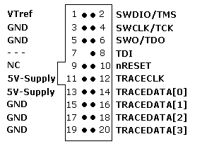
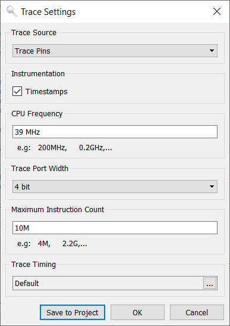

# etm\_zwave
Z-Wave Embedded Trace Module (ETM) debugging example code

The ETM is an invaluable tool for debugging embedded code and measuring code coverage in real-time.
More details on ETM can be found on the [ARM](https://developer.arm.com/documentation/ddi0337/h/embedded-trace-macrocell/about-the-etm) and [Segger](https://www.segger.com/) web sites.

The example code here is provided AS-IS and without warrantee.

# Setup

## Hardware

- Z-Wave Developers Kit - WSTK and a Radio board
    - Or your board assuming it has the JTrace pins
- [Segger J-Trace Pro](https://www.segger.com/products/debug-probes/j-trace/)
    - The Cortex-M model is sufficient for Z-Wave debug (the cheaper one)
    - Cables and power source
- J-Trace 20 pin connector pinout: 
    - 0.05" (1.27mm) spacing
- Connect the DUT to the J-Trace and ensure the Target Power is green

## Software

- Simplicity Studio (for building the code)
- Segger [Ozone](https://www.segger.com/products/development-tools/ozone-j-link-debugger/]Debugger) (supports ETM trace)
    - SVD files for the respective EFR32 - see the SVD folder
- This repo contains JLink scripts and other files needed for tracing

# Step by Step Instructions

1. Clone this repo into your Z-Wave project
2. Build the project in SSv5
3. Open Ozone
4. Click on the New Project wizard and select the .AXF file for the project. Ozone will find the source code files via the .axf file.
5. Click on File-\>Edit Project file (opens the .jdebug file)
6. Add the following lines to the end of the OnProjectLoad section
    1. Project.AddSvdFile ("$(ProjectDir)/etm\_zwave/svd/EFR32XG13XFULL.svd"); 
        1. Use the .svd file that matches your DUT
        2. For the modules, just use the base-SoC part which has the same internal registers which is what the .SVD defines
    2. Project.SetOSPlugin("FreeRTOSPlugin"); 
7. Scroll down to the BeforeTargetConnect section
    1. uncomment the call and the }
    2. Add the following line with the proper chip for your DUT
        1. Project.SetJLinkScript("$(ProjectDir)/etm_zwave/ZGM130S_Traceconfig.JLinkScript"); 
8. Enable Tracing
    1. Tools-\>Trace Settings 
9. Click on View -\> Instruction Trace, Code Profile, Timeline and any other windows desired
10. Click on Download and Reset Program  
11. Review the console window and look for any errors
12. The DUT should stop at the beginning of Main() and there is data in the Timeline

# Reference Documents

- [Segger Wiki on xG21](https://wiki.segger.com/Silicon_Labs_EFR32xG21)

# ToDo

- How to route other pins used for tracing
- Can 2 or even 1 trace pin produce decent results?
- Explore using faster clocks that may be needed to use fewer pins
    - currently the AUXHFCLK is used on the ZGM130 which is ~19Mhz and async to the HFXO.

# Contacts
- Eric Ryherd - drzwave@silabs.com - Author

