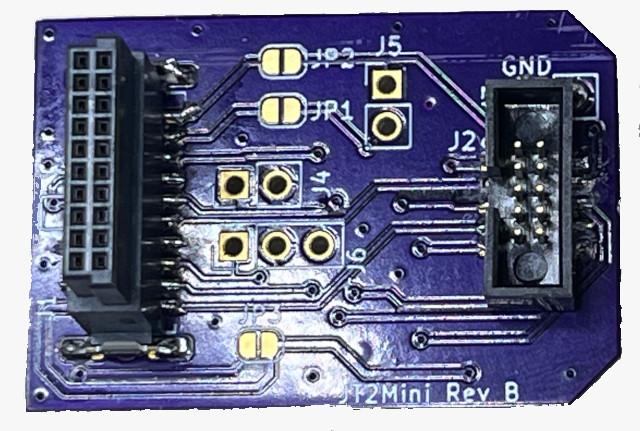
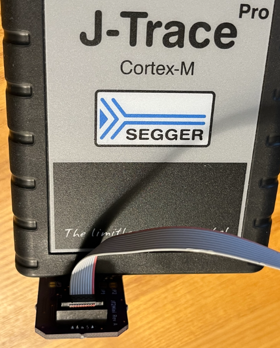

# J-Trace 19 pin to 10-pin MiniSimplicity Adapter PCB

This folder contains the KiCAD database for a small PCB that
provides a solid connection from the 19 pin 0.05" header on the
Segger J-Trace to the Silicon Labs MiniSimplicity header.

The board is plugged directly into the J-Trace without a cable. Be VERY careful to align the pins correctly! 
The DUT is then typically connected with a Tag-Connect or a Minisimplicity ribbon cable.
The cable should be short - less than 1 foot. There is only a single ground pin. The data rate of the pins is 20MHz so a short cable is necessary to ensure signal integrity.
Additional ground wire(s) between the JT2Mini and DUT are recommended to improve signal integrity. The wires should be the same length as the Tag-Connect cable.

This board assumes the PTI pins are NOT wired to the MiniSimplicity header and the D1 and D2 trace pins are wired in their place.

Ordering the PCB from a proto PCB house like [OSH-Park](https://oshpark.com/) is cheap (less than $10 for 3!) and fast.

The PCB is easily hand-soldered as there are no active components. The connectors are a bit small so you do need decent soldering skills and perhaps a magnifying glass. 

# ZGx23 to MiniSimplicity Connections

Trace requires the TRACECLK and at least 1 TRACEDATA pin. Fortunately TRACEDATA0 is the SWO pin so it is already wired to the MiniSimplicity header. The JT2Mini adapter typically provides 2 data pins which works with minimal stalling of the CPU.
The typical connections to the MiniSimplicity header for use with this adapter are as follows:

| Name | Port Pin | ZG23 pin # | ZGM230 Pin # | MiniSimplicity Header | Comments |
| ---     | ---  | --- | --- | --- | --- |
| TRACECLK | PA04 | 29 | 16 | 9  | Trace Clock instead of PTISYNC |
| TRACED0  | PA03 | 28 | 15 | 6  | TRACEDATA0 also SWO |
| TRACED1  | PA05 | 30 | 17 | 10 | TRACEDATA1 instead of PTIDATA  |

This connection differs from the typical connections described in various Silabs datasheets as the Packet Trace (PTI) Interface pins are normally wired to pins 9 and 10. 
The PTI is normally used for the Zniffer however most Z-Wave debug uses a standalone Zniffer which is typically a USB stick. Trace is much more important for debugging than the Zniffer coming from the DUT.

# Gerbers

The JT2Mini-Gerbers.zip file contains the Gerber files for ordering the PCB from any prototype PCB manufacturer.
Some PCB houses (like OSHPark) accept the KiCAD files directly.

# Bill Of Materials (BOM)

1. J1 - 20 pin header - [CBEC224-1079B001C1AF](https://www.digikey.com/en/products/detail/greenconn/CBEC224-1079B001C1AF/16529509) - $2.34
2. J2 - 10 pin header - [3220-10-0300-00](https://www.digikey.com/en/products/detail/cnc-tech/3220-10-0300-00/3883266) - $0.78

Plus the PCB of course. A 2-pin GND jumper from the DUT to the JT2Mini is recommended for improved signal integrity.

# Schematic 

See the [Schematic](./JT2Mini/JT2MiniSchematic.pdf) PDF if you don't have KiCAD installed.

